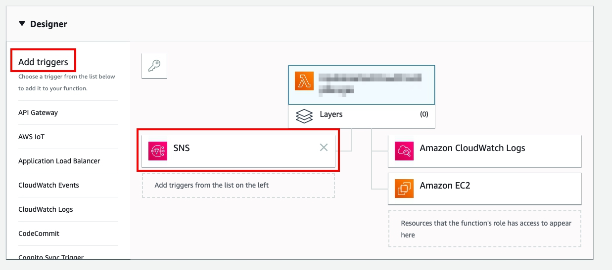
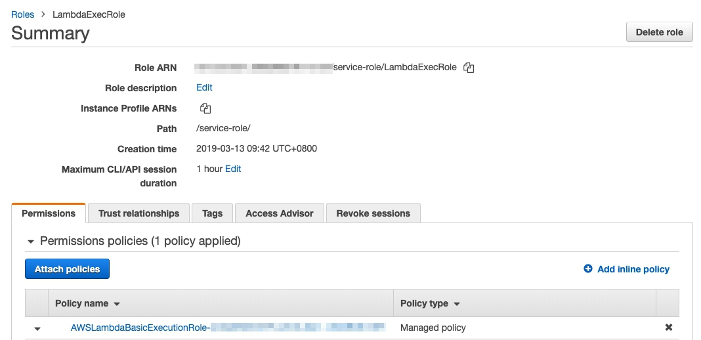

# AWS SOP -- Update Security Groups Lambda with Cloudfront

## Intro
### Update Security Groups
A Lambda function for updating the cloudfront EC2 security group ingress rules with the CloudFront IP range changes.

### Note
This code is not written by me, it is from AWS.

## Set up
### 建立 4 個Security Group

1. 在選單中選擇 EC2，左邊選單選擇 **Security Group**.

2. 選擇 Create Security Group : 
    * Security group name : `cloudfront_r_https`
    * Description : `regional_https`

3. 點選 Create。

4. 在頁面下方，點選標籤 **Tags**，點選 **Add/Edit Tags**

5. Create Tag : 
    * Key : `AutoUpdate`
    * Value : `true`

6. Create Tag : 
    * Key : `Name`
    * Value : `cloudfront_r`

7. Create Tag and **Save**: 
    * Key : `Protocol`
    * Value : `https`


8. 選擇 Create Security Group : 
    * Security group name : `cloudfront_r_http`
    * Description : `regional_http`

9. 點選 Create。

10. 在頁面下方，點選標籤 **Tags**，點選 **Add/Edit Tags**

11. Create Tag : 
    * Key : `AutoUpdate`
    * Value : `true`

12. Create Tag : 
    * Key : `Name`
    * Value : `cloudfront_r`

13. Create Tag and **Save**: 
    * Key : `Protocol`
    * Value : `http`

14. 選擇 Create Security Group : 
    * Security group name : `cloudfront_g_https`
    * Description : `global_https`

15. 點選 Create。

16. 在頁面下方，點選標籤 **Tags**，點選 **Add/Edit Tags**

17. Create Tag : 
    * Key : `AutoUpdate`
    * Value : `true`

18. Create Tag : 
    * Key : `Name`
    * Value : `cloudfront_g`

19. Create Tag and **Save**: 
    * Key : `Protocol`
    * Value : `https`

20. 選擇 Create Security Group : 
    * Security group name : `cloudfront_g_http`
    * Description : `global_http`

21. 點選 Create。

22. 在頁面下方，點選標籤 **Tags**，點選 **Add/Edit Tags**

23. Create Tag : 
    * Key : `AutoUpdate`
    * Value : `true`

24. Create Tag : 
    * Key : `Name`
    * Value : `cloudfront_g`

25. Create Tag and **Save**: 
    * Key : `Protocol`
    * Value : `http`

26. 在服務選單，點選 **Lambda**，**Create Function**

27. 選擇 **Author from Scratch**，並在 Basic Function 中填入：
    * Function name：`UpdateLatestCloudFrontIpRanges`
    * Runtime : Python 3.7
    * Execution role : Use an existing role
    * Existing role : service-role/LambdaExecRole

28. **Create Function**.

29. 把附檔的 lambdaautoupdate.py 在 Function Code 內

30. 在 Basic Setting 中，Timeout 選擇 15 秒。

31. 滑到 Lambda 頁面最上面，在 add trigger 的選項中，選擇 SNS，並且點選 SNS。

<p align="center">
   
</p>

32. 在 arn 中輸入 `arn:aws:sns:us-east-1:806199016981:AmazonIpSpaceChanged`，名字選擇`AmazonIpSpaceChanged`，點選 **Save**

33. 在右上角點選 **Save**

34. 在 Save test events 的下拉式選單中選擇 Configure test event
    * 輸入名字：`testautoupdate`
    * 在下方的格子輸入並且 **Save**：
```
{
  "Records": [
    {
      "EventVersion": "1.0",
      "EventSubscriptionArn": "arn:aws:sns:EXAMPLE",
      "EventSource": "aws:sns",
      "Sns": {
        "SignatureVersion": "1",
        "Timestamp": "1970-01-01T00:00:00.000Z",
        "Signature": "EXAMPLE",
        "SigningCertUrl": "EXAMPLE",
        "MessageId": "95df01b4-ee98-5cb9-9903-4c221d41eb5e",
        "Message": "{\"create-time\": \"yyyy-mm-ddThh:mm:ss+00:00\", \"synctoken\": \"0123456789\", \"md5\": \"7fd59f5c7f5cf643036cbd4443ad3e4b\", \"url\": \"https://ip-ranges.amazonaws.com/ip-ranges.json\"}",
        "Type": "Notification",
        "UnsubscribeUrl": "EXAMPLE",
        "TopicArn": "arn:aws:sns:EXAMPLE",
        "Subject": "TestInvoke"
      }
    }
  ]
}
```
35. 執行後會有錯誤訊息，複製以下一段
` "errorMessage": "MD5 Mismatch: got 1ddec89cdf9f5579d862c645b8827e29 expected 7fd59f5c7f5cf643036cbd4443ad3e4b" `, 貼到 test function 裡的
“Message" 的 md5 把 `7fd59f5c7f5cf643036cbd4443ad3e4b` 換成`1ddec89cdf9f5579d862c645b8827e29`

36. 點選 Test，成功！！！


## More IAM Role and Policy for Lambda

<p align="center">
   
</p>

* Policy

```
{
    "Version": "2012-10-17",
    "Statement": [
        {
            "Effect": "Allow",
            "Action": [
                "ec2:AuthorizeSecurityGroupIngress",
                "ec2:RevokeSecurityGroupIngress"
            ],
            "Resource": "arn:aws:ec2:ap-southeast-1:950080657611:security-group/*"
        },
        {
            "Effect": "Allow",
            "Action": "ec2:DescribeSecurityGroups",
            "Resource": "*"
        },
        {
            "Action": [
                "logs:CreateLogGroup",
                "logs:CreateLogStream",
                "logs:PutLogEvents"
            ],
            "Effect": "Allow",
            "Resource": "arn:aws:logs:*:*:*"
        }
    ]
}
```